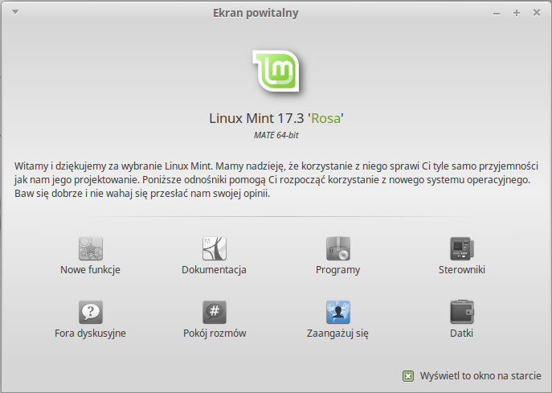

# Ekran powitalny
Kiedy pierwszy raz uruchomisz Pulpit Mate (i za każdym razem dopóki nie odznaczysz kratki na dole ekranu) pojawi się Ekran Powitalny. Możesz go także uruchomić z Poziomu Menu.

Przejrzyj dobrze ten ekran, gdyż zawiera wiele interesujących odnośników. Możesz tam znaleźć odnośnik do Przewodnika (tak, zgadza się, właśnie go czytasz :-)). Poklikaj, na pewno warto się z nimi zapoznać.
