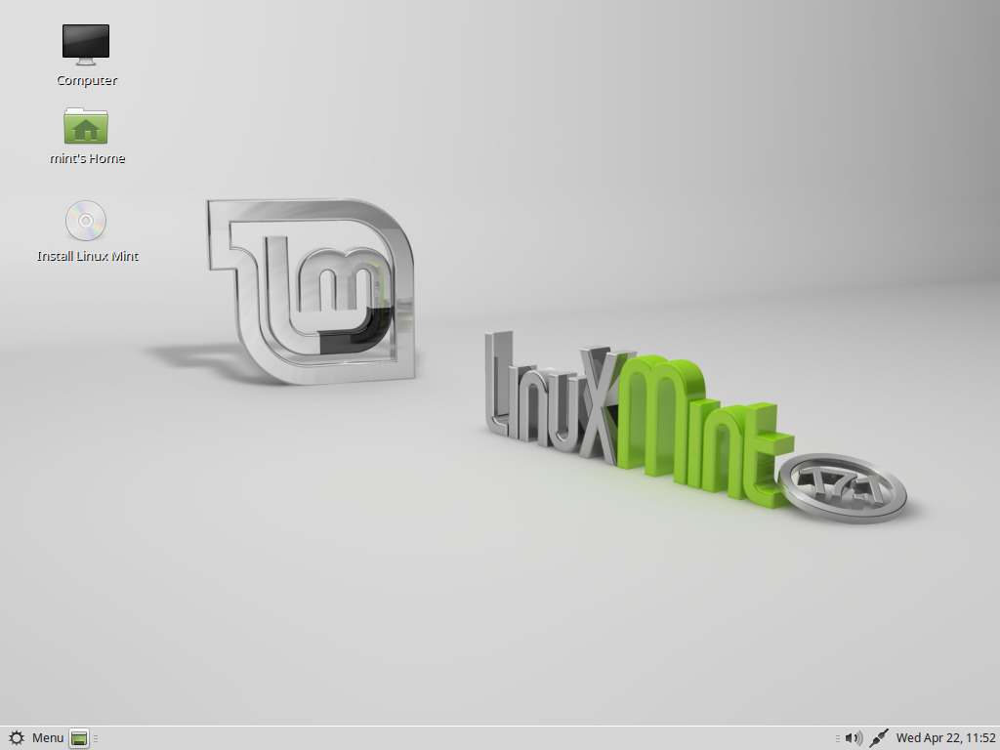
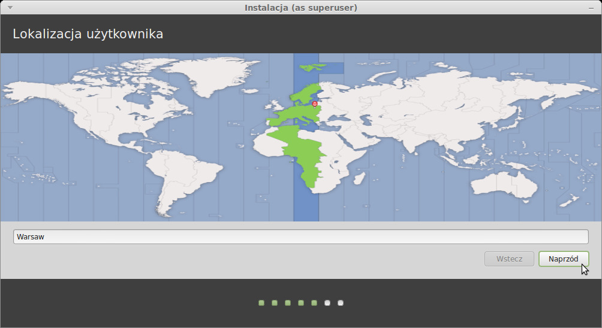

# Instalacja Linux Mint na dysku twardym
Z pierwszego ekranu wybierz domyślną opcję **Start Linux Mint** i naciśnij Enter.

Po krótkiej chwili system powinien się uruchomić i zobaczysz pulpit:

Na tym etapie Linux Mint nie jest zainstalowany na komputerze, jest po prostu uruchomiony z płyty DVD. System, który widzisz, jest niemal dokładnie taki sam jak po zakończonej instalacji.

Pobaw się nim i zobacz czy Ci się spodoba. Miej na uwadze, że kiedy uruchamiasz go z DVD, Linux Mint działa znacznie wolniej niż kiedy jest zainstalowany na dysku, ponieważ musi odczytywać dane z napędu DVD, który jest wolniejszym urządzeniem niż dysk twardy.

Kiedy będziesz gotowy, kliknij podwójnie na ikonkę **Install Linux Mint** zlokalizowaną na Pulpicie. Pojawi się instalator:

Jeśli nie czytałeś jeszcze uwag do wydania (Release Notes) a masz połączenie z Internetem to jest idealna okazja do zapoznania się z nimi teraz; po prostu kliknij podkreślony odnośnik. Rekomendowane jest aby przed instalacją użytkownik zapoznał się z nowymi opcjami, jak również wszelkimi kwestiami, które mogą mieć wpływ na konfigurację sprzętową.

Wybierz swój język i kliknij przycisk **Naprzód**.

Na kolejnym ekranie, upewnij się, że masz podłączone źródło zasilania (jeśli używasz laptopa), Internet oraz, że masz wystarczającą ilość wolnego miejsc na dysku. Następnie naciśnij przycisk **Naprzód**

Kolejny ekran pozwoli Ci przypisać całą dostępną powierzchnię dysku dla Linux Mint lub zainstalować go obok innych systemów. Jako alternatywę, możesz samodzielnie zdefiniować partycje i przydzielić je ręcznie.

* Jeśli wybierzesz użycie całego dysku, jego zawartość zostanie wykasowana i Linux Mint zostanie zainstalowany jako jedyny system operacyjny na komputerze.
* Jeśli wybierzesz instalację obok innego systemu operacyjnego, instalator użyje wolnej przestrzeni na innych partycjach aby stworzyć nową dla Linux Mint’a. Będziesz zapytany jak wielka przestrzeń ma być przydzielona dla niego. Instalator zmniejszy partycję i zadba o wszystko za Ciebie. Po instalacji, Twój komputer będzie Cię witał tzw. boot screen’em po uruchomieniu. Będziesz mógł wybrać, który system wystartować.
* Jeśli wybierzesz ręczne określenie partycji, pojawi się edytor partycji dając Ci pełną kontrolę nad procesem partycjonowania Twojego dysku twardego. Ta opcja jest rekomendowana dla zaawansowanych użytkowników, którzy rozumieją jak działa partycjonowanie pod Linuxem. Miej na uwadze, że Linux Mint wymaga partycji o wielkości minimum 6GB oraz to, że zalecana wielkość SWAP to 1.5x wielkość pamięci RAM dostępnej w komputerze.

Wybierz właściwą opcję i kliknij **Naprzód**

Na kolejnym ekranie zostaniesz poproszony o potwierdzenie. Kiedy klikniesz na **Instaluj** - instalacja rozpocznie się.

Na tym etapie instalacja będzie odbywać się w tle a instalator zada Ci kilka pytań:

Wskaż swoją lokalizację na mapie poprzez wybranie miasta najbliżej Ciebie. Celem tego kroku jest zidentyfikowanie Twojej strefy czasowej. Upewnij się, że zegar jest ustawiony prawidłowo i kliknij **Naprzód**

**Uwaga:** *Czasami instalator nie jest w stanie wykryć przesunięcia czasowego (czas letni/zimowy), nawet po wskazaniu poprawnego miasta możesz zauważyć różnice w czasie. Na tym etapie możesz to zignorować, ale pamiętaj o upewnieniu się, że zegar jest ustawiony prawidłowo po ponownym uruchomieniu komputera.*

Wybierz swój układ klawiatury. Jeśli nie jesteś pewny jaki dokładnie układ odpowiada Twojej klawiaturze, kliknij w pole tekstowe na dole ekranu i zacznij pisać. Upewnij się, że znaki klawiszy, które naciskasz odpowiadają znakom w polu tekstowym w tej samej kolejności. Niektóre układy różnią się tylko znakami interpunkcyjnymi, znakami specjalnymi i liczbami, więc upewnij się, że je także sprawdziłeś.

Kiedy będziesz gotowy kliknij **Naprzód**

Wprowadź swoje prawdziwe imię, nazwę użytkownika oraz hasło. Za każdym razem, kiedy użyjesz Linux Mint’a, użyjesz konta z tą nazwa użytkownika i hasłem. Kiedy Linux Mint zostanie zainstalowany, będziesz miał możliwość dodania innych kont,  o  ile inni ludzie będą używali tego komputera.

Podaj także nazwę dla komputera. Ta nazwa będzie wykorzystana przez Twój komputer w sieci oraz w kilku miejscach Twojego systemu. Jeśli nigdy nie zastanawiałeś się nad nazwą Twojego komputera, teraz masz na to czas. Ludzie najczęściej wybierają kwiaty (róża, tulipan) lub planety (mars, jowisz, pluton) jako nazwy swoich komputerów w sieci.
To całkowicie zależy od Ciebie, ale wybierz nazwę, którą łatwo zapamiętać.

**Uwaga:**  *Wielkie litery, spacje i znaki specjalne są niedozwolone, zarówno  w nazwie użytkownika jak i nazwie komputera.*

Jeśli jesteś jedyną osobą używającą  komputera, możesz pominąć ekran logowania poprzez zaznaczenie opcji **Zaloguj automatycznie**.

Kiedy będziesz gotowy, kliknij **Naprzód**

Instalator może wykryć inne systemy na Twoim komputerze i zapytać Cię o zmigrowanie Twoich informacji osobistych. Zazwyczaj pozwoli Ci przenieść zakładki, kontakty, ulubione itd. z innego systemu operacyjnego zainstalowanego na komputerze do nowo instalowanego Linux Mint'a.

Kiedy będziesz gotowy, kliknij **Naprzód**

Instalacja powinna zająć około 10-15 min.

**Uwaga:** *Instalator pobierze pakiety  z Internetu dla języka, który wybrałeś. Twój komputer wymaga połączenia z Internetem aby to zrealizować. W przeciwnym wypadku  **Pomiń** ten krok, będziesz miał możliwość dodania wsparcia dla Twojego języka po zakończeniu instalacji i ponownym uruchomieniu systemu.*

Kiedy instalacja dobiegnie końca, wybierz **Uruchom ponownie**.

Usuń DVD z napędu, kiedy zostaniesz o to poproszony i naciśnij ENTER.

Twój komputer jest gotowy do uruchomienia Linux Mint z dysku twardego.

