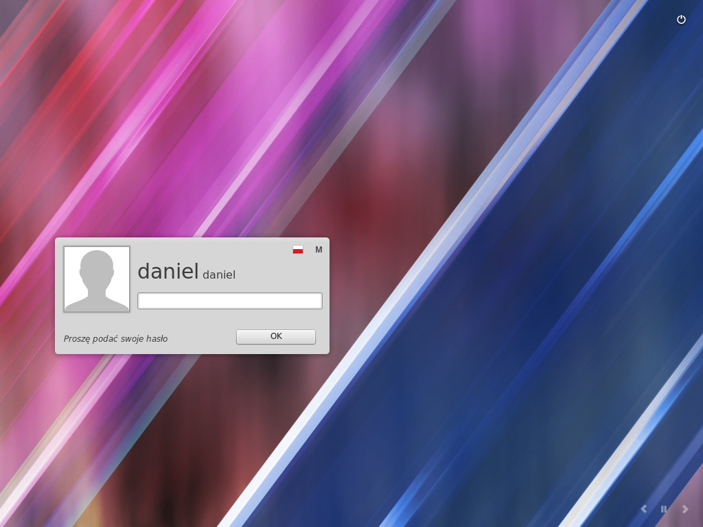

# Kolejność uruchomienia
Po ponownym uruchomieniu, jeśli posiadasz zainstalowany więcej niż jeden system operacyjny, powinieneś zobaczyć tzw. boot menu.

Kiedy Linux Mint zostanie uruchomiony, zostaniesz przywitany ekranem do wprowadzenia nazwy użytkownika i hasła. Ekran ten nazywa się **MDM Login Manager**, w skrócie zwany po prostu **MDM**. Wprowadź hasło, które wybrałeś podczas instalacji.

**Uwaga:** *Domyślnie hasło dla **root** jest takie samo, jak hasło, które ustawiłeś podczas instalacji. Jeśli nie wiesz co to oznacza, nie przejmuj się tym.*
